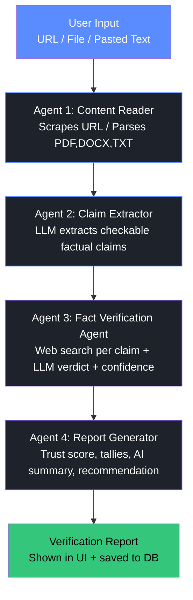

# AI Agent Flow — Fake News & Fact Verification Agent

Paste this into [mermaid.live](https://mermaid.live) or any Markdown viewer with Mermaid support
(GitHub renders it natively) to see the diagram. A static rendered version is at
`agent-flow-diagram.svg` in this folder.
